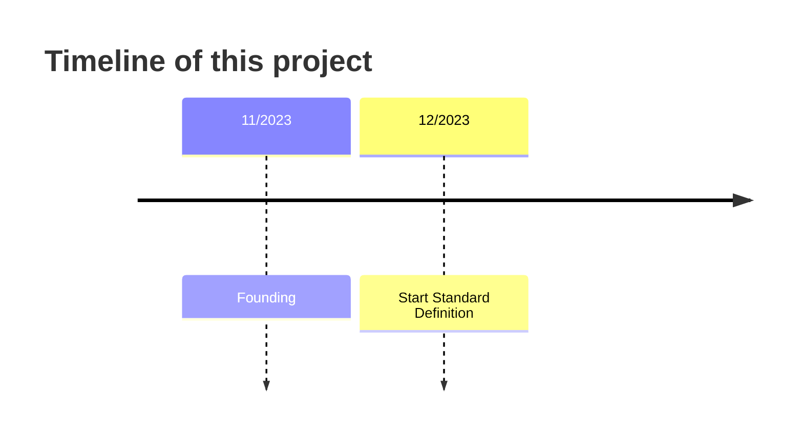
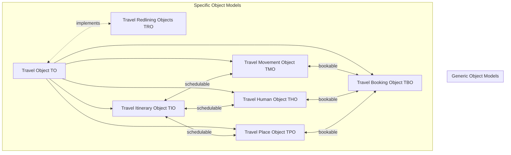

# Travel Exchange Data Model (TXDM)
This project is intended for establishing a standard for the exchange of travel information between different systems. This is an evolving standard, everyone can collaborate.

# Overview
We at OSSTRA have noticed that there are no standardized ways on how to plan and execute travel.

The goal of this project is to simplify and speed up data transfer between participants in the vacation planning industry.

We believe that the solution is to establish an industry standard data exchange format between data creators, processors and users. Together, we will try to achieve this goal by establishing common data models within this project so anybody can make use of them.

**Feel free to submit pull requests**

# Current State
This project just started. Please register your interest in the dicussion forum.

I am looking for people to contribute to the project. Together, we will continuing to define the architecture and implementation. Please participate in the open issues.

Any code in the repo is in active development, please do thorough testing and verification before implementing for production use.

# Background

## Background to the problem

The vacation planning industry is primarily made up from big corporations providing accomodations, tech companies proving booking services, small companies offering packaged tours and small actors executing individual vacation planning services.

Every step of the vacation planning lifecycle is currently more or less isolated and unconnected. Planning is done in Excel, Booking is done on Booking Platforms, Communication to Participants is individually prepared. 

### Motivation and goals

The motivation is to stop the usage of sub-optimal tools for vacation planning and to introduce an open solution for individuals and small businesses to use to create vacaiton iterinaries.

# Implementation

The standard has been split in so-called **Travel Objects (TO)**, which each are responsible for indidual functions of travel planning. None of these elements is required, allowing the creation and exchange of Travel Data in various stages of the Travel Planning Life Cycle.

## Concept

| title | responsibility| description |
|-------------|-------------|-------------|
|[Travel Place Objects (TPO)](https://github.com/OSSTRA/TXDM/blob/main/Travel%20Place%20Objects%20(TPO).md)|Places| Depicting points of interest within a travel plan           |
|[Travel Movement Objects (TMO)](https://github.com/OSSTRA/TXDM/blob/main/Travel%20Movement%20Objects%20(TMO).md)|Transportation| Depicting transportation within a travel plan           |
|[Travel Human Objects (THO)](https://github.com/OSSTRA/TXDM/blob/main/Travel%20Human%20Objects%20(THO))|Participation | Depicting members of the travel plan, including responsibilities           |
|[Travel Booking Objects (TBO)](https://github.com/OSSTRA/TXDM/blob/main/Travel%20Booking%20Objects%20(TBO).md)|Reservation Management| Depicting bookings and reservations           |
|[Travel Itinerary Objects (TIO)](https://github.com/OSSTRA/TXDM/blob/main/Travel%20Itinerary%20Objects%20(TIO).md)|Scheduling| Scheduling all other objects types to create a plan           |
|[Travel Redlining Objects (TRO)](https://github.com/OSSTRA/TXDM/blob/main/Travel%20Redlining%20Objects%20(TRO).md)|Reviewing| Add comments to all objects of the plan           |

## Features
- Versioning
- Tagging

## Normative Sections

1. The Concepts for Data Types
2. The JSON Schema for Data Types
3. Open API for centralized approcations: Application API and specific
4. The Generic Data API for data exchange: Generic Data API

## Acknowledgements
This standard has been based on the previous work of:

- [ICAR Animal Data Exchange JSON Standards](https://github.com/adewg/ICAR)

## Glossary

## Contributing

The project welcomes contributions of all kinds.

- Read and make suggestions using the Issues List
- The default branch is set to ADE-1 which is the current release. This is to make it easier for organisations to clone and use the specifications. If you expect to contribute you will need to work on the Develop branch instead.
- Propose changes by logging an issue, then creating your own fork of the Develop branch and proposing a Pull Request that will be reviewed by the maintainers.
