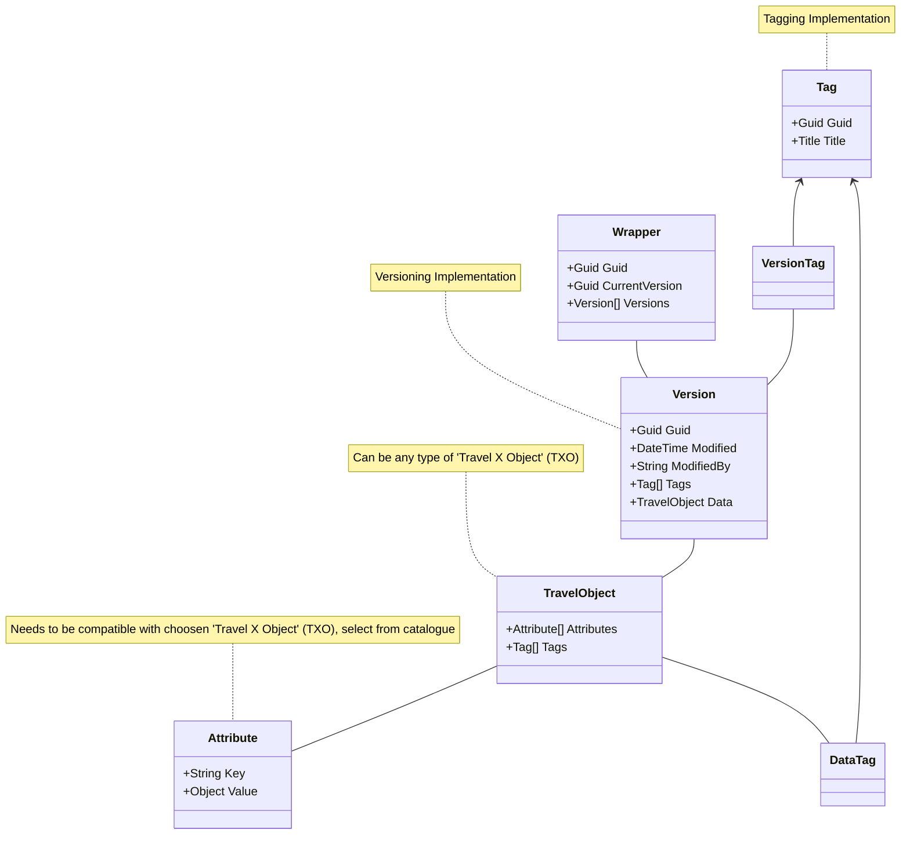

## Travel Object (TO)
This data standard is based among a base concept - the 'Travel Object (TO)'. This data structure contains metadata for base functionality offered by this data exchange standard. 

### Functionality
#### Versioning
Keeping track of all changes executed in a travel plan to allow a transparent overview about data evolution.

#### Tagging
Allowing to include tags in the data allows to depict data evolution in a way that is understandable by humans.

### Concept




### Example
```json
{
    "Guid": "512ef6c1-7163-4e90-b581-87563857b9be",
    "CurrentVersion:"",
    "Versions": [
        {
            "Guid": "512ef6c1-7163-4e90-b581-87563857b9be",
            "Modified": "2007-12-24T18:21Z",
            "ModifiedBy": "max.mustermann@gmx.de",
            "Tags": [
                {
                    "Guid": "512ef6c1-7163-4e90-b581-87563857b9be",
                    "Title": "Version 1" //optional
                }
            ],
            "TravelObject": {
                // Travel X Object (TXO) Implementation
            }
        }
    ]
}
```
