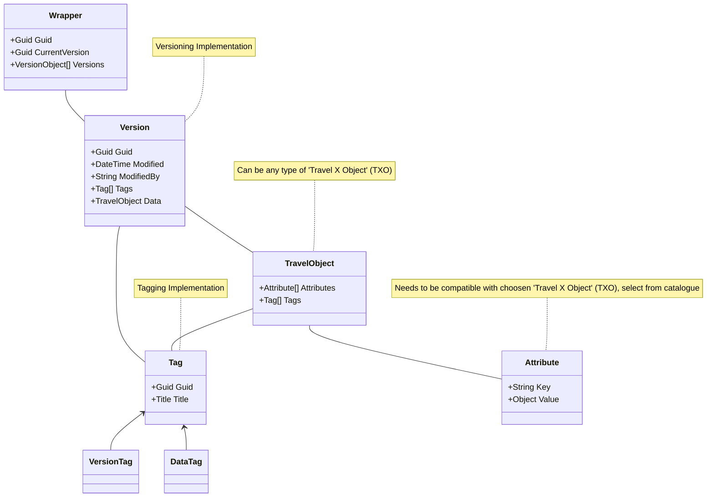

## Travel Object (TO)
This data standard is based among a base concept - the 'Travel Object (TO)'. This data structure contains metadata for base functionality offered by this data exchange standard. 

### Functionality
#### Versioning
Keeping track of all changes executed in a travel plan to allow a transparent overview about data evolution.

#### Tagging
Allowing to include tags in the data allows to depict data evolution in a way that is understandable by humans.

### Concept

